

# Kivorly 🇧🇩
### The Everything Super App for Bangladesh

  A high-performance multi-platform super app unifying <b>Rides, Travel Tickets, Parcel Courier, Brand Shopping, Daily Groceries, Hotel Stays, Food Delivery, and Home Services</b> across Dhaka and all 64 districts in Bangladesh.

---

## 📱 App Preview

| Home Dashboard | Live Navigation | Express Ride | Food & Dining |
| :---: | :---: | :---: | :---: |
| 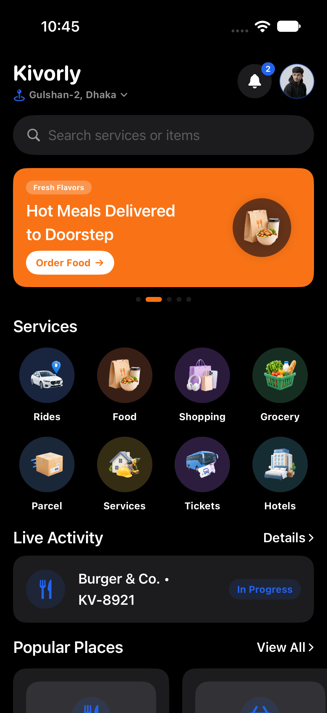 | 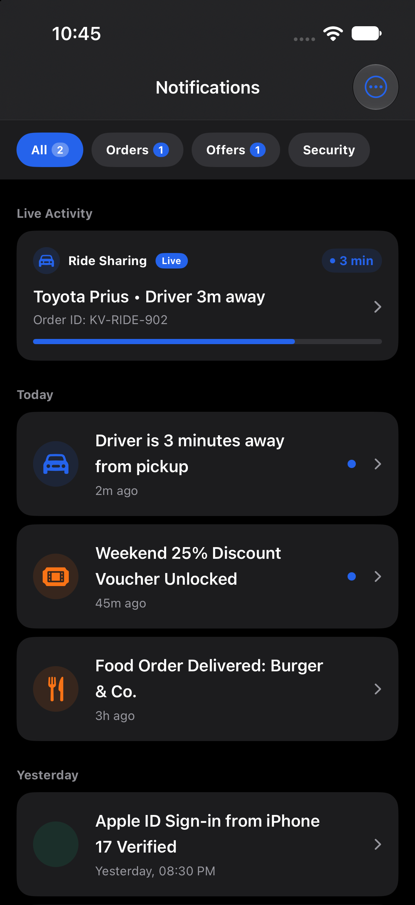 | 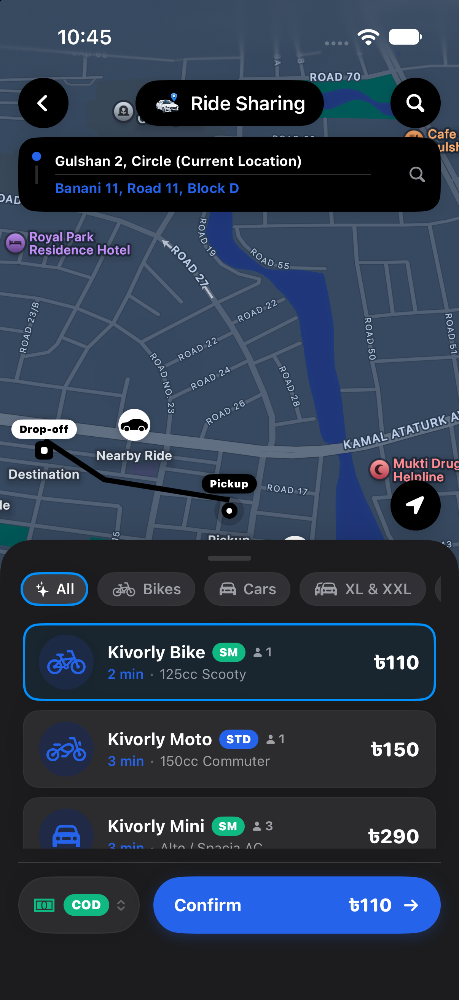 | 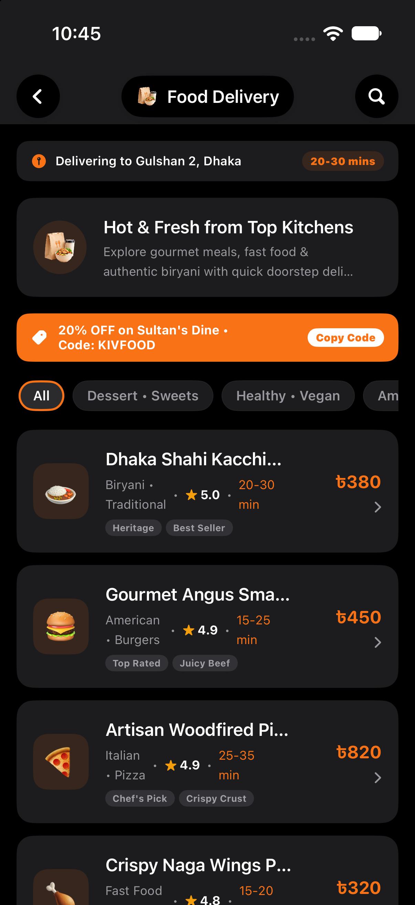 |

 

<h4>📸 View More Service Screenshots (Click to expand)</h4>

 

| Explore Directory | Inter-City Tickets | Express Courier | Brand Shopping |
| :---: | :---: | :---: | :---: |
| 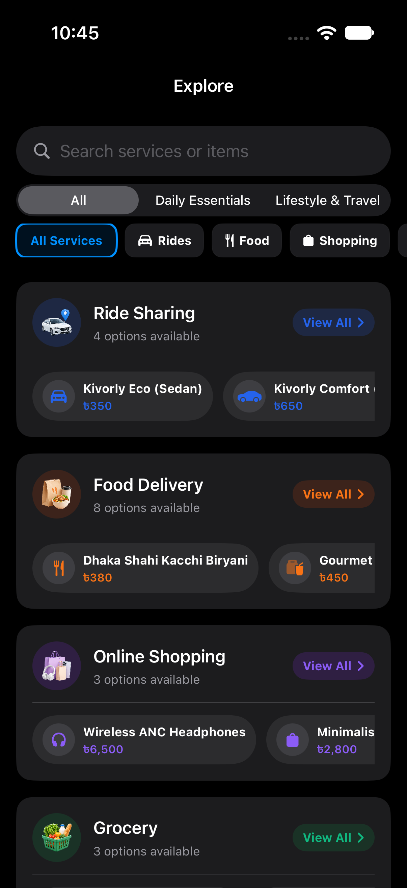 | 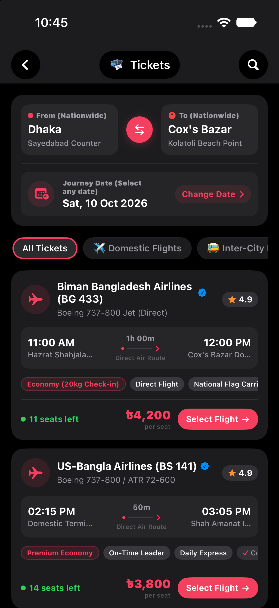 | 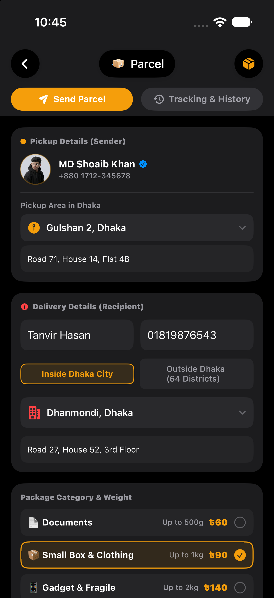 | 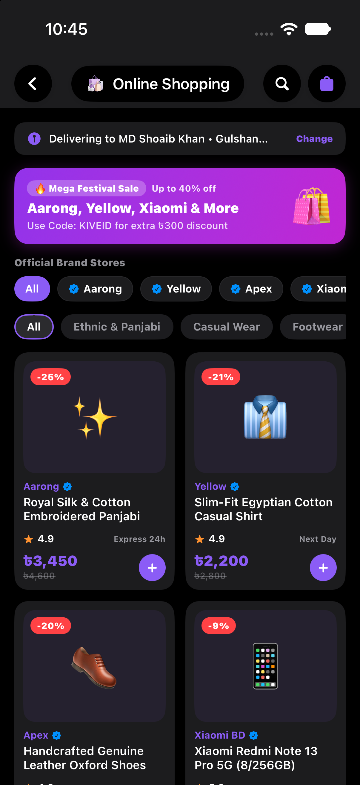 |

| Fresh Bazaar | Hotel & Resorts | Verified Services | Orders & Tracking |
| :---: | :---: | :---: | :---: |
| 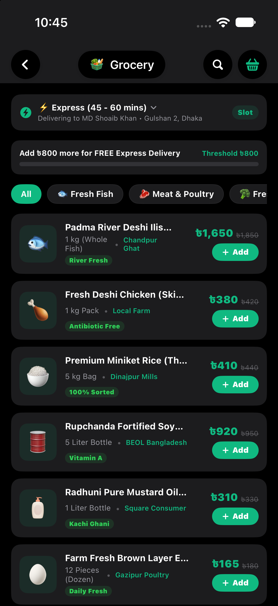 | 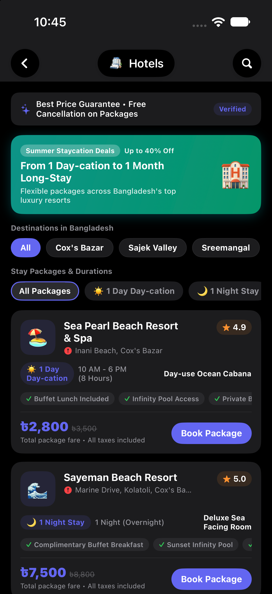 | 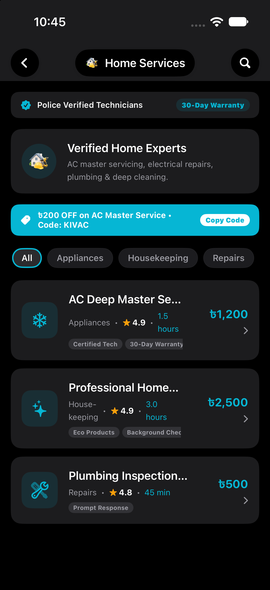 |  |

---

## ⚡ Core Verticals

| Vertical | Description |
| :--- | :--- |
| 🚗 **Ride Sharing** | Real-time vehicle hailing across Dhaka with fare transparency and live GPS tracking. |
| 🎫 **Tickets & Travel** | Bus, domestic flights, train, and launch bookings across all 64 districts. |
| 📦 **Express Parcels** | Same-day city courier & nationwide delivery with Cash on Delivery (COD). |
| 🛍️ **Brand Mall** | Curated official lifestyle and tech stores (Yellow, Aarong, Walton, Apex). |
| 🥬 **Fresh Bazaar** | 1-hour doorstep delivery of fresh produce, pantry essentials, and fish/meat. |
| 🏖️ **Hotels & Stays** | Verified resorts and vacation rentals in Cox's Bazar, Sylhet, and Sajek. |
| 🍔 **Food Delivery** | Fast doorstep dining from top local and international restaurants. |
| 🛠️ **Home Services** | On-demand certified appliance repair, plumbing, and deep cleaning. |

---

## 📦 Releases & Versioning

Releases follow [Semantic Versioning](https://semver.org/) (`vMAJOR.MINOR.PATCH`).

- **Official Release**: Push a version tag (e.g. `git tag v1.0.0 && git push origin v1.0.0`) to trigger automated multi-platform builds and release publication.
- **Manual Trigger**: Run the workflow manually from GitHub Actions with `publish_release=true` and your target version tag.

---

  Copyright © 2026 Kivorly Technologies. All rights reserved.

